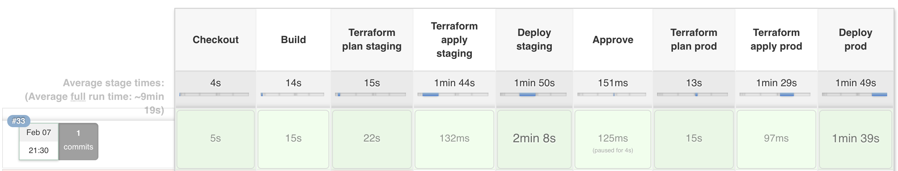

# jenkins-terraform-microservice

A demo project of a (Java) microservice, deployed via a [Jenkins pipeline](./Jenkinsfile) to AWS ElasticBeanstalk provisioned by [terraform scripts](./infrastructure).

The deployment pipeline looks like this:



## Goals

* Staging and production environments
* Infrastructure is defined in the same repository as the microservice application code
* Minimal boilerplate needed to reduce repetition in each microservice


## Set up

Create a Github Organization Folder in your jenkins instance and configure the github organization name.
You can use mine (`ulich`) or you can fork the repository and configure your name. If you get "Github Quota Exceeded"
messages, you should configure credentials and provide your Github username + Api Key.

Jenkins will now scan the github organization for any repository with a Jenkinsfile in it and
it should create a job named `jenkins-terraform-microservice`.

Make sure your jenkins instance is able to connect to AWS by either using IAM roles if your jenkins instance
is running on an ec2 instance or by setting up the aws cli with your secret key.


## Jenkins pipeline

The [Jenkinsfile](./Jenkinsfile) uses a utility method from [ulich/jenkins-pipeline-library](https://github.com/ulich/jenkins-pipeline-library/blob/master/vars/microservice.groovy).

This is what happens inside the pipeline (pseudo-code):
```
build_app

# deploy to staging
# -----------------

terraform init
terraform workspace select default
terraform plan -out staging-planfile
wait_for_approval "check the console output of the terraform plan"
terraform apply staging-planfile
eb deploy


wait_for_approval "check that staging still works"


# deploy to prod
# --------------

terraform workspace select prod
terraform plan -out prod-planfile
wait_for_approval "check the console output of the terraform plan"
terraform apply prod-planfile
eb deploy
```


## Terraform

The [infrastructure](./infrastructure) folder contains terraform scripts that
define the infrastructure needed for this microservice. It uses a terraform module
to reduce the amount of code needed in each microservice repository.

You could define additional resources needed for the microservice (database instances, etc.)
in this folder.

You are maybe wondering where the provider or S3 state bucket configuration is. It is generated
by the [Jenkins pipeline#generateTerraformConfig method](https://github.com/ulich/jenkins-pipeline-library/blob/master/vars/microservice.groovy#L62)
in order to reduce the boilerplate needed in each microservice.
